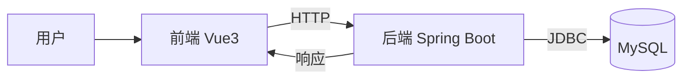

# 流程图谱

用 mermaid 画核心业务与前后端联调流程，帮助 `testing-run` 理解端到端路径。

## 示例：前后端联调

```mermaid
flowchart LR
  U[用户] --> FE[前端 Vue3]
  FE -->|HTTP| BE[后端 Spring Boot]
  BE -->|JDBC| DB[(MySQL)]
  BE -->|响应| FE
```

## 关键流程

{{FLOWS}}
