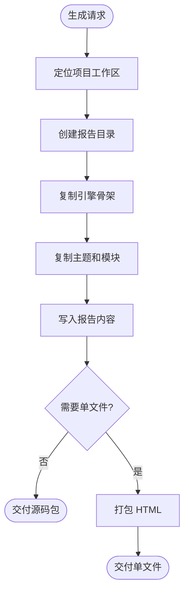

# 输出包

默认输出可维护的源码包。以下结构相对 `visual-report-workspace/projects/{project-slug}/`：

```text
README.md
content/
├── content.json
└── sources.json 或 evidence-ledger.json
dist/{report-slug}/
├── index.html
├── report.config.json
├── content.json
├── styles/
│   ├── report.css
│   ├── theme.css
│   └── theme-fonts.css
├── scripts/
│   ├── theme-runtime.js
│   ├── report.js
│   └── modules/              # 仅当存在模块脚本时创建
├── modules/                  # 仅当存在模块 HTML 片段时创建
└── report.bundled.html 可选
```

## 打包流程



## 文件语义

| 文件 | 含义 |
|---|---|
| `index.html` | 最终报告入口，引用包内本地 CSS/JS。 |
| `report.config.json` | 机器可读的生成记录：风格、引擎、模块、生成时间、打包状态。 |
| `content/content.json` | 报告使用的结构化内容。只有完全手写报告才可以省略。 |
| `content/sources.json` 或 `content/evidence-ledger.json` | 来源台账和关键 claim 到 source 的映射。 |
| `README.md` | 项目级维护入口：报告入口、任务材料、验证命令、已知风险。 |
| `dist/{report-slug}/content.json` | 可选的报告运行时数据副本；有时为了静态页面加载保留。 |
| `styles/report.css` | 引擎结构 CSS。 |
| `styles/theme.css` | 从引擎主题目录复制出的当前主题 CSS。 |
| `scripts/report.js` | 当前报告专用 JS，初始化选中的模块。 |
| `scripts/modules/*.js` | 从 `viz-modules` 复制或改写的可选模块片段。 |
| `modules/*.html` | 可选的模块 section 参考。 |

## 规则

- 使用相对路径，让报告可以直接从本地磁盘打开。
- 不要默认内联 CSS/JS。
- 禁止创建空目录、空文件或 `.keep` 占位文件；`modules/`、`scripts/modules/`、`report.bundled.html` 等可选项只有真实产物存在时才创建。
- 只有用户要求或分享场景必须单文件时才打包。
- 生成报告包必须放在项目工作区的 `dist/{report-slug}/`。
- 除临时本地测试外，不要把生成报告包放回 skill 源目录。
- `report.config.json` 必须记录 `project_slug`、`report_slug`、`run_id`、`workspace_root`、`responsive_viewports`。
- 项目根必须有 `README.md`；不能只交付 `dist/`。
- 关键来源必须在 `content/sources.json` 或 `content/evidence-ledger.json` 中可审计；HTML 附录只能作为展示层。
- 链接检查结果写入 `qa/{report-slug}/`。403、412、502、503 等自动检查失败要标明需要人工复核，不能默认删源。
