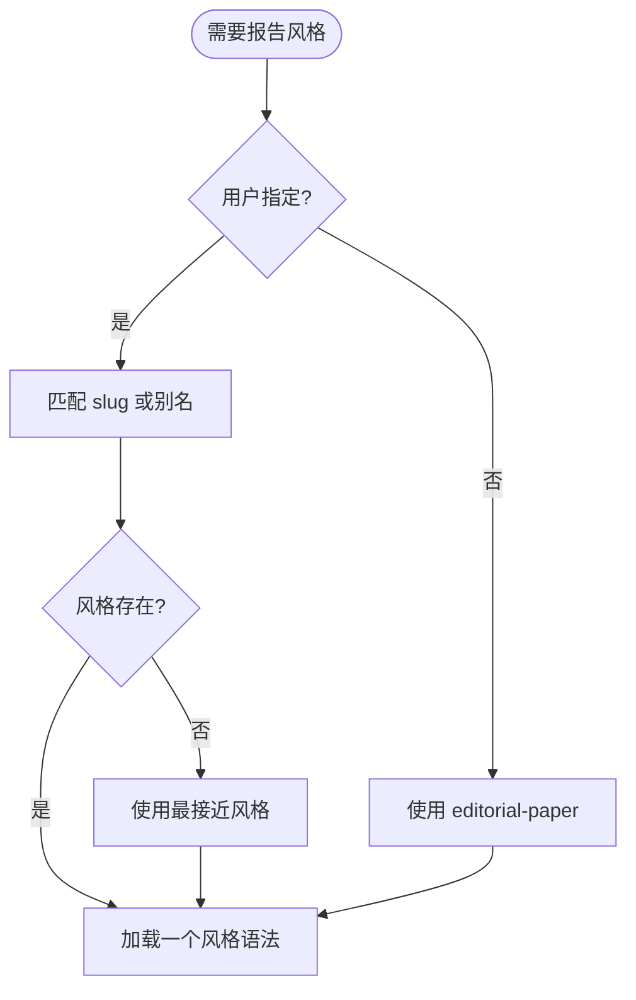

# 风格选择

默认风格：`editorial-paper`。

## 判断流程

## 默认提示

如果用户没有指定风格，说：

> 未指定报告风格，我先用默认 `editorial-paper` 生成；后续可以直接说“换成 xxx 风格”。

然后继续生成。不要停下来等确认。

## 换风格

当用户说“换成 xxx 风格”：

1. 优先替换 `styles/theme.css`。
2. 更新 `report.config.json.style`。
3. 重新检查字体排版、表格宽度、图表对比度和模块密度。
4. 只有新风格破坏可读性或层级时，才改写布局。

## 引擎扩展口

每个风格语法都会声明 `engine`。如果选中的风格使用不同引擎，就使用该引擎的 starter 和模块。不要强行把所有风格塞进 `token-report`。
