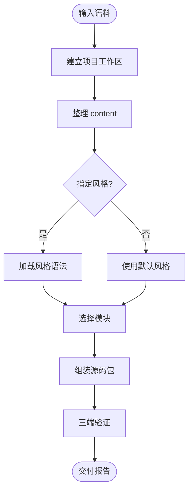

# 工作流

这个 skill 只有一条生产线。保持短、清晰、可执行。

## 步骤契约

| 步骤 | 读取 | 写入 |
|---|---|---|
| 建立项目工作区 | `references/workspace-contract.md` | `visual-report-workspace/projects/{project-slug}/` |
| 整理报告大纲 | `references/report-contract.md` | `content/content.json` |
| 选择风格 | `references/theme-selection.md`、一个 `style-grammar/{slug}.md` | `report.config.json.style` |
| 选择可视化模块 | `viz-modules/INDEX.md`、仅命中的模块目录 | `report.config.json.modules` |
| 组装源码包 | `references/output-package.md`、`engines/{engine}/starter.html` | `dist/{report-slug}/` |
| 三端验证 | `references/quality-checklist.md`、`tools/verify-report.mjs` | `qa/{report-slug}/` 和修复后的文件 |

## 不做什么

- 原始调研抽取属于另一个 skill。
- 完整展厅不是生产源。
- 生成出来的是报告，不是 App。
- 换风格不等于重写报告，除非布局真的坏了。
- 不要把多个项目的输入、中间物、报告包混放在同一个 `dist/` 下。
